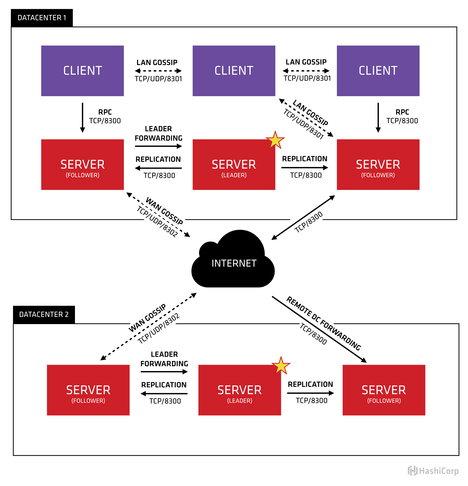
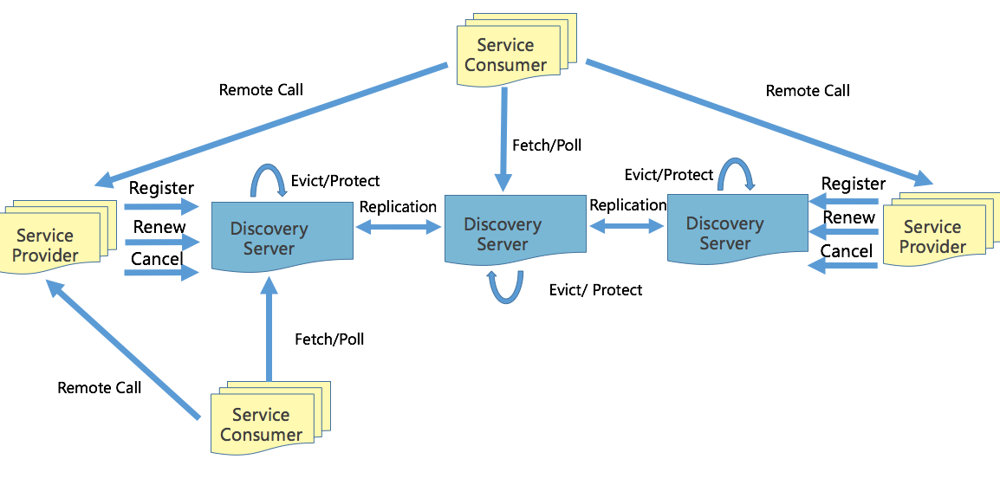

# Lesson 01 Go 架构实践

> * 微服务概览
> * 微服务设计
> * gRPC & 服务发现
> * 多集群 & 多租户

## 微服务概览

| 架构       | 定义                                                                                                                                                                                                                                                              | 优点                                           | 缺点                       |
|------------|-------------------------------------------------------------------------------------------------------------------------------------------------------------------------------------------------------------------------------------------------------------------|------------------------------------------------|----------------------------|
| 单体架构   | 数据库，服务器，前端表示层部署在同一个应用中                                                                                                                                                                                                                      | 开发、测试、部署高效简单                       | 扩展困难、可靠性低         |
| 微服务架构 | 围绕业务功能构建的，服务关注单一业务，服务间 采用轻量级的通信机制，可以全自动独立部署，可 以使用不同的编程语言和数据存储技术。<br/> 微服务架 构通过业务拆分实现服务组件化，通过组件组合快 速开发系统，业务单一的服务组件又可以独立部署， 使得整个系统变得清晰灵活 | 原子服务、独立进程、隔离部署、去中心化服务治理 | 运维基础设施建设、复杂度高 |

* 组件服务化
  * kit:一个微服务基础库 kit
  * service: 业务逻辑+kit 依赖+第三方依赖组成的微服务
  * rpc+mq: 微服务间轻量级通讯([gRPC](https://github.com/grpc/grpc-go) + [kafka](https://github.com/apache/kafka))
* 按业务组织服务『[康威定律](https://zh.wikipedia.org/wiki/%E5%BA%B7%E5%A8%81%E5%AE%9A%E5%BE%8B)』
  * 开发团队对软件在生产环境的运行负全部责任！
  * 开发团队对软件在生产环境的运行负全部责任！
  * 开发团队对软件在生产环境的运行负全部责任！
* 去中心化
  * 数据去中心化（每个服务独享数据存储设施，利于服务独立性）
  * 治理去中心化
  * 技术去中心化
* 基础设施自动化
  * CICD: gitlab+Gitlab Hook +k8s
  * Testing: 测试环境部署，单元测试、API 自动化测试 （推荐[Yapi](https://github.com/YMFE/yapi)）
  * 在线运行时: [k8s](https://www.kubernetes.org.cn/), [Prometheus](https://github.com/prometheus/prometheus)
* 可用性&兼容性设计『[伯斯塔尔法则](https://en.wikipedia.org/wiki/Robustness_principl)』
  * 隔离
  * 超时控制
  * 负载保护
  * 限流
  * 熔断
  * 降级
  * 重试
  * 负载均衡

## 微服务设计

### API-Gateway

> 统一的协议出口，在服务内进行大量的 dataset join，按照业务场景来设计粗粒度的 API，给后续服务的演进带来的很多优势

[BFF(Back-end For Front-end)服务于前端的后端](https://www.jianshu.com/p/9cca72f9e93c)

### 微服务划分

在实际项目中通常会采用两种不同的方式划分服务边界：

1. 通过业务职能(Business Capability)
2. DDD 的限界上下文(Bounded Context)

CQRS(Command Query Responsibility Segregation) 将应用程序分为两部分：命令端和查询端。命令端处理程序创建、更新和删除请求，并在数据更改时发出事件。查询端通过针对一个或多个物化视图执行查询来处理查询，这些物化视图通过订阅数据更改时发出的事件流而保持最新。

* [订阅 binlog 的中间件 canal](https://github.com/alibaba/canal)
* [canal_mysql_nosql_sync](https://github.com/liukelin/canal_mysql_nosql_sync)

### 微服务安全

完整请求流程：
API Gateway  --> BFF --> Service Biz Auth --> JWT --> Req args

在服务内部，要区分身份认证和授权，一般有三种：

* Full Trust
* Half Trust
* Zero Trust

## gRPC & 服务发现

> 不要过早关注性能问题，先标准化

### gRPC 简介

* [gRPC 中文官方文档](http://doc.oschina.net/grpc)
* [gRPC 健康检查协议](https://github.com/grpc/grpc/blob/v1.15.0/doc/health-checking.md)

### 服务发现

* 客户端发现
  1. 一个服务实例被启动时，它的网络地址会被写到注册表上；
  2. 当服务实例终止时，再从注册表中删除；
  3. 这个服务实例的注册表通过心跳机制动态刷新；
  4. 客户端使用一个负载均衡算法，去选择一个可用的服务实例，来响应这个请求。
  * 直连，比服务端发现少一次网络跳转，Consumer 需要内置特定的服务发现客户端和发现逻辑
* 服务端发现
  1. 客户端通过负载均衡器向一个服务发送请求
  2. 这个负载均衡器会查询服务注册表，并将请求路由到可用的服务实例上。
  3. 服务实例在服务注册表上被注册和注销(Consul Template+Nginx， kubernetes+etcd)。
  * Consumer 无需关注服务发现的细节，只需知道服务的 DNS 域名即可，支持异构语言开发，需要基础设施支撑，多一次网络跳转，可能有性能损耗

### Consul

<details>
<summary>Consul 架构</summary>



[Consul Architecture](https://www.consul.io/docs/architecture)
</details>

### Eureka

<details>
<summary>Eureka 架构</summary>



Register: 服务注册。服务的提供者，将自身注册到注册中心，服务提供者也是一个 Eureka Client。当 Eureka Client 向 Eureka Server 注册时，它提供自身的元数据，比如 IP 地址、端口，运行状况指示符 URL，主页等。

Renew: 服务续约。Eureka Client 会每隔 30 秒发送一次心跳来续约。

Cancel: 服务下线。Eureka Client 在程序关闭时向 Eureka Server 发送取消请求。

Remote Call: 远程调用。当 Eureka Client 从注册中心获取到服务提供者信息后，就可以通过 Http 请求调用对应的服务；服务提供者有多个时，Eureka Client 客户端会通过 Ribbon 自动进行负载均衡。

Eviction： 服务剔除。当 Eureka Client 和 Eureka Server 不再有心跳时，Eureka Server 会将该服务实例从服务注册列表中删除，即服务剔除。

Eureka Server 在运行期间会去统计心跳失败比例在 15 分钟之内是否低于 85%，如果低于 85%，Eureka Server 即会进入自我保护机制。

### 工作原理

1. Eureka Server 启动成功，等待服务端注册。在启动过程中如果配置了集群，集群之间定时通过 Replicate 同步注册表，每个 Eureka Server 都存在独立完整的服务注册表信息
2. Eureka Client 启动时根据配置的 Eureka Server 地址去注册中心注册服务
3. Eureka Client 会每 30s 向 Eureka Server 发送一次心跳请求，证明客户端服务正常
4. 当 Eureka Server 90s 内没有收到 Eureka Client 的心跳，注册中心则认为该节点失效，会注销该实例
5. 单位时间内 Eureka Server 统计到有大量的 Eureka Client 没有上送心跳，则认为可能为网络异常，进入自我保护机制，不再剔除没有上送心跳的客户端
6. 当 Eureka Client 心跳请求恢复正常之后，Eureka Server 自动退出自我保护模式
7. Eureka Client 定时全量或者增量从注册中心获取服务注册表，并且将获取到的信息缓存到本地
8. 服务调用时，Eureka Client 会先从本地缓存找寻调取的服务。如果获取不到，先从注册中心刷新注册表，再同步到本地缓存
9. Eureka Client 获取到目标服务器信息，发起服务调用
10. Eureka Client 程序关闭时向 Eureka Server 发送取消请求，Eureka Server 将实例从注册表中删除

</details>

### Nacos

<details>
<summary>Nacos 架构</summary>


[Nacos Architecture](https://nacos.io/zh-cn/docs/architecture.html)
</details>

Documents

* [Consul](https://www.consul.io/docs)
* [Eureka](https://github.com/Netflix/eureka/wiki)
* [Eureka 工作原理](https://blog.csdn.net/qwe86314/article/details/94552801)
* [nacos](https://nacos.io/zh-cn/docs/what-is-nacos.html)
* [bilibili/discovery](https://github.com/bilibili/discovery)

Servic Mesh 会变得很复杂
## 多集群 & 多租户
### 多集群

* 多集群的必要性
  * 从单一集群考虑，多节点保证可用性，N+2 的节点来冗余节点
  * 单一集群故障带来的影响考虑冗余多套集群
  * 单机房内的机房故障导致的问题

### 多租户

> 在一个微服务架构中允许多系统共存是利用微服务稳定性以及模块化最有效的方式之一，这种方 式一般被称为多租户(multi-tenancy)。租户可以是测试，金丝雀发布，影子系统(shadow systems)，甚至服务层或者产品线，使用租户能 够保证代码的隔离性并且能够基于流量租户做路由决策。

多租户架构本质上描述为：

跨服务传递请求携带上下文(context)，数据隔离的流 量路由方案。

## Q&A

1. [第一课问题收集](https://shimo.im/docs/x8dxHkQRcdCHX8j3/read)
2. [第二课问题收集](https://shimo.im/docs/WxJp66WCtjVwKDK3)
3. Github 图片无法显示问题， `/etc/hosts` 文件写入以下内容，刷新浏览器即可

   ```bash
   # GitHub Start
    140.82.114.4 github.com
    140.82.114.4 gist.github.com
    185.199.108.153 assets-cdn.github.com
    151.101.64.133 raw.githubusercontent.com
    151.101.108.133 gist.githubusercontent.com
    151.101.108.133 cloud.githubusercontent.com
    151.101.108.133 camo.githubusercontent.com
    151.101.108.133 avatars0.githubusercontent.com
    151.101.108.133 avatars1.githubusercontent.com
    151.101.108.133 avatars2.githubusercontent.com
    151.101.108.133 avatars3.githubusercontent.com
    151.101.108.133 avatars4.githubusercontent.com
    151.101.108.133 avatars5.githubusercontent.com
    151.101.108.133 avatars6.githubusercontent.com
    151.101.108.133 avatars7.githubusercontent.com
    151.101.108.133 avatars8.githubusercontent.com
    # GitHub End
   ```

## Documents

* [SRE：Google运维解密](https://item.jd.com/11973579.html) ☆☆☆☆☆
* [UNIX环境高级编程第3版](https://item.jd.com/12720738.html) ☆☆☆☆☆
* [HTTP2](https://http2-explained.haxx.se/zh)
* [K8S中文社区](https://www.kubernetes.org.cn/)
* [Kubernetes教程](https://www.kuboard.cn/learning/)
* [Prometheus](https://github.com/prometheus/prometheus)
* [grafana](https://github.com/grafana/grafana)
* [gRPC 中文官方文档](http://doc.oschina.net/grpc)
* [gRPC-go](https://github.com/grpc/grpc-go)
* [kafka](https://github.com/apache/kafka)
* [Golang gRPC实践 连载](https://segmentfault.com/a/1190000007880647)
* [如何通过gRPC实现高效远程过程调用？](https://time.geekbang.org/column/article/247812)
* [跟煎鱼学 Go](https://eddycjy.com/go-categories/)
* [Consul](https://github.com/hashicorp/consul)
* [Eureka](https://github.com/Netflix/eureka/wiki)
* [nacos](https://nacos.io/zh-cn/docs/what-is-nacos.html)
* [bilibili/discovery](https://github.com/bilibili/discovery)
* [canal](https://github.com/alibaba/canal)
* [canal_mysql_nosql_sync](https://github.com/liukelin/canal_mysql_nosql_sync)
* [四层和七层负载均衡的区别](https://kb.cnblogs.com/page/188170/)
* [macvlan](https://www.cnblogs.com/bakari/p/10893589.html)
* [Gossip协议：流言蜚语，原来也可以实现一致性](https://time.geekbang.org/column/article/208182)

## References

### [康威定律(Conway’s law)](https://zh.wikipedia.org/wiki/%E5%BA%B7%E5%A8%81%E5%AE%9A%E5%BE%8B)

"设计系统的架构受制于产生这些设计的组织的沟通结构。"

> * 第一定律 组织沟通方式会通过系统设计表达出来
> * 第二定律 时间再多一件事情也不可能做的完美，但总有时间做完一件事情
> * 第三定律 线型系统和线型组织架构间有潜在的异质同态特性
> * 第四定律 大的系统组织总是比小系统更倾向于分解

### [伯斯塔尔法则(Postel’s Law)](https://en.wikipedia.org/wiki/Robustness_principle)

Be conservative in what you send, be liberal in what you accept。
“对发送的内容保持谨慎，对接收的内容保持自由”

> * 发送的数据要更保守， 意味着最小化的传送必要的信息
> * 接收时更开放意味着要最大限度的容忍冗余数据，保证兼容性

### [CAP 理论](http://www.ruanyifeng.com/blog/2018/07/cap.html)

* 一致性（Consistency）
* 可用性（Availability）
* 分区容错性（Partition Tolerance）

> CAP 不可能三角说的是对于一个分布式系统而言，一致性（Consistency）、可用性（Availability）、分区容错性（Partition Tolerance）3 个指标不可兼得，只能在 3 个指标中选择 2 个。

* CA 模型，在分布式系统中不存在。因为舍弃 P，意味着舍弃分布式系统，就比如单机版关系型数据库 MySQL，如果 MySQL 要考虑主备或集群部署时，它必须考虑 P。
* CP 模型，采用 CP 模型的分布式系统，舍弃了可用性，一定会读到最新数据，不会读到旧数据。一旦因为消息丢失、延迟过高发生了网络分区，就影响用户的体验和业务的可用性（比如基于 Raft 的强一致性系统，此时可能无法执行读操作和写操作）。典型的应用是 Etcd，Consul 和 Hbase。
* AP 模型，采用 AP 模型的分布式系统，舍弃了一致性，实现了服务的高可用。用户访问系统的时候，都能得到响应数据，不会出现响应错误，但会读到旧数据。典型应用就比如 Cassandra 和 DynamoDB。

* [CAP理论：怎样舍弃一致性去换取性能？](https://time.geekbang.org/column/article/251062)
* [CAP理论：分布式系统的PH试纸，用它来测酸碱度](https://time.geekbang.org/column/article/195675)
* [ACID理论：CAP的酸，追求一致性](https://time.geekbang.org/column/article/199663)

---
